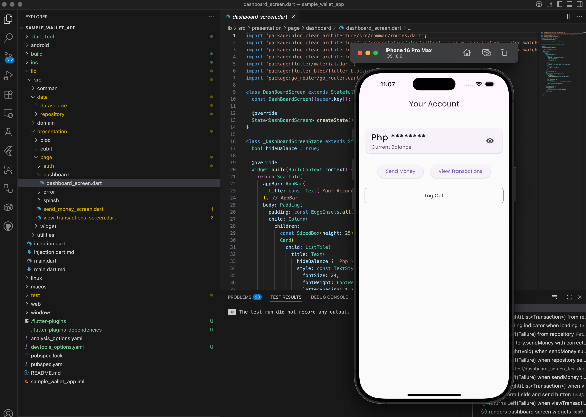
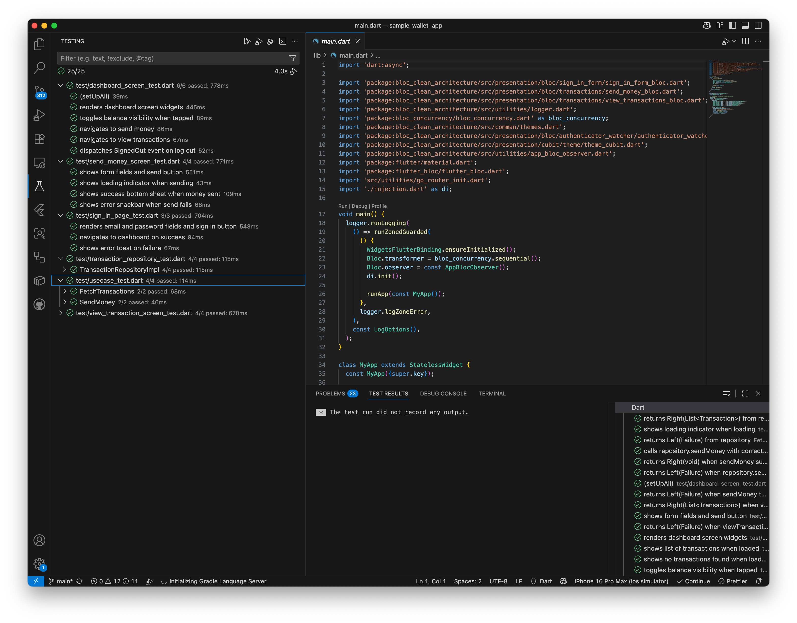

# sample_wallet_app

A Flutter wallet application.

## Getting Started

### Prerequisites

- [Flutter SDK](https://docs.flutter.dev/get-started/install)
- Dart (comes with Flutter)
- Android Studio or Xcode (for mobile development)

### Running the App

#### Command Line

1. **Install dependencies:**
   ```sh
   flutter pub get
   ```
2. **Run the app on an emulator or connected device:**
   ```sh
   flutter run
   ```
   You can specify a device with `-d <device_id>` if you have multiple devices/emulators.

#### Using VS Code

You can also run the app directly from Visual Studio Code:

1. Open the project in VS Code.
2. Select your target device from the device selector at the bottom right.
3. Press <kbd>F5</kbd> or click the green **Run** button to launch the app.



### Running Tests

#### Command Line

To run all unit and widget tests:

```sh
flutter test
```

Test files are located in the `test/` directory.

#### Using VS Code

You can also run tests in VS Code:

1. Open the project in VS Code.
2. Open the test file you want to run, or right-click the `test/` folder.
3. Click the **Run** or **Debug** test icons above the test functions, or use the Testing sidebar.


